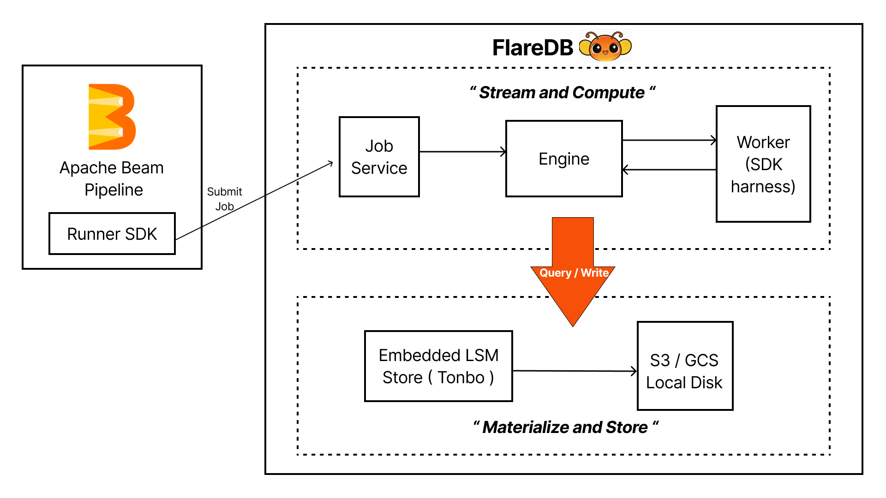

<div align="center">
  
</div>

**FlareDB** is a streaming database for building and running batch and streaming data pipelines. It uses the Apache Beam as its programming interface. Beam provides a rich programming model for expressing batch and streaming data pipelines in Java, Python, Go and SQL, while FlareDB provides a Rust based runtime to execute pipelines written with Beam SDKs.

Its based on a unified streams-and-tables architecture. Streams represent data in motion, while tables represent that same data as materialized state. FlareDB brings these concepts together in a single engine. As pipelines execute, PCollections transition naturally between streams and materialized table state, allowing FlareDB to unify data processing and storage within a single system.

<div align="center">
  
</div>

## Getting Started

### 1. Start FlareDB

Clone the repository and start a local FlareDB instance.

```bash
git clone https://github.com/flare-db/flare-db.git
cd flare-db

# run script
./flareup.sh
```
The startup script creates the required directories, downloads the FlareDB and Beam SDK worker binaries, and starts the local FlareDB instance. Once the server is running, it is ready to accept Beam pipeline jobs.

### 2. Configure Your Beam Pipeline

To run a Beam pipeline on FlareDB, add the FlareDB Runner SDK as a dependency to your Apache Beam project. The Runner SDK submits the pipeline to the running FlareDB instance for execution.

See the WordCount example under `examples/` for a complete reference.

### 3. Run the Example

With FlareDB running, execute the WordCount example:

```bash
# compile wordcount pipeline
mvn clean install

# run
mvn exec:java -Dexec.mainClass="com.flaredb.example.WordCount"
```

The pipeline will be submitted to the local FlareDB instance and executed by the engine. Execution logs and pipeline output can be found in the logging directory created during startup.

## Status

**FlareDB V0.1.0** is the first public release of FlareDB. It lays the foundation for a streaming database and its execution engine.

The initial release supports:

* Single-node execution of Apache Beam pipelines.
* Bounded sources on the Global Window.
* Native execution of core runner transforms, including `Impulse` and `GroupByKey`.
* Portable `DoFn` execution through the Beam SDK Harness.
* Apache Beam Portability Framework implementation.

### Roadmap

The next releases will focus on implementing the streaming execution.

* **Unbounded Sources** - Support for watermarks, event-time processing, windowing, and triggers.
* **Splittable DoFns** - Parallel work execution for I/Os.
* **Stateful Processing** - Implementation of the Apache Beam State API.
* **Native Transforms** - Additional runner-native implementations for element-wise, aggregation, and composite transforms.
* **Materialized Views** - Persist Beam `PCollections` as queryable table state for serving and analytics.


## License

FlareDB is licensed under the Apache License 2.0 
